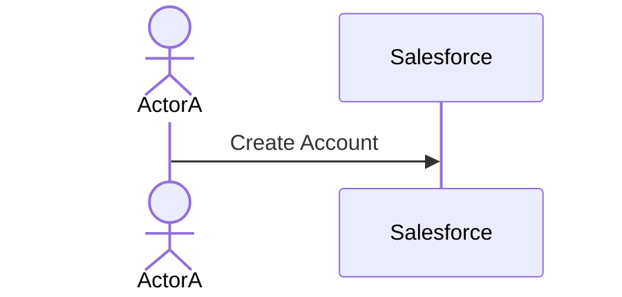
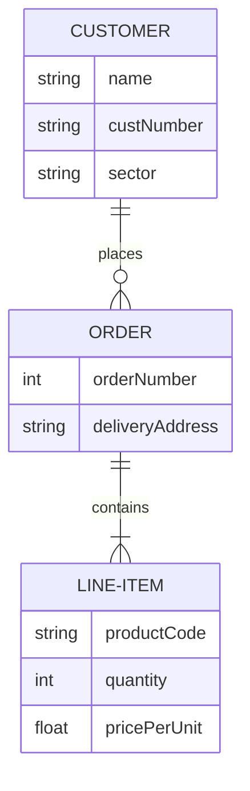
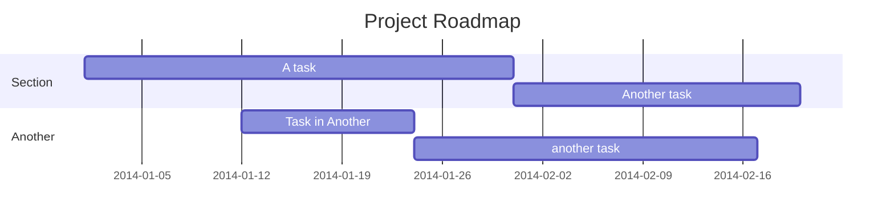

# PROPOSAL: {{cookiecutter.project_name}}

## Overview

The process is simple: first we define the problem, and based on that we propose one or more possible solutions.

## Problem Statement

What problem do we want to solve?

### Requirements

#### Functional Requirements

- FR001:
- FR002:

#### Technical Requirements

- TR001:
- TR002:

#### Out of Scope

- OOS001:
- OOS002:

### Business Process

Identify the business process.

## Proposed Solution

### Entities

#### Entity-Relationship Diagram (ERD)

#### Facts

#### Dimensions

### Deliverables

Number | Name | Description | Effort
---------|----------|---------|---------
 1 | Approval | Business user approves this proposal | Med
 2 | B2 | C2 | Low
 3 | B3 | C3 | High

### Roadmap

